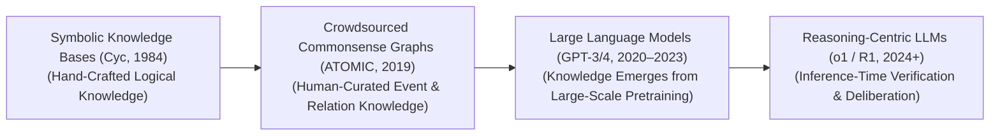
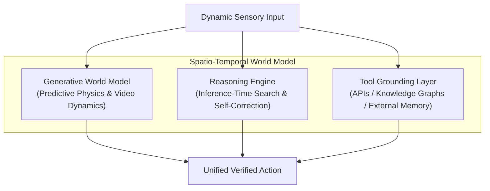

  

# 🌟 Awesome-Commonsense-Reasoning

> **Keywords**: Commonsense Reasoning, Artificial Intelligence, Spatio-Temporal World Models, Large Language Models (LLM), reinforcement learning, symbolic logic, ATOMIC, Cyc, GPT-4, o1, DeepSeek-R1, generative world simulators, process-supervised step verifiers (PRMs), Theory of Mind, abductive reasoning.

## Commonsense Reasoning in AI: History, Progression, Variants, & Applications

**Commonsense Reasoning** is a foundational cognitive paradigm in artificial intelligence dedicated to enabling machines to understand, infer, and apply the implicit, unwritten background knowledge that humans use naturally to navigate daily life. This includes basic physical tracking (e.g., knowing that a dropped glass will shatter), psychological intent (e.g., inferring that someone reaching for water is thirsty), and abstract social scripts. 

While standard deep learning systems excel at isolating complex statistical patterns or recognizing explicit objects, they historically lacked this conceptual anchor. This deficit leads to bizarre hallucinations and catastrophic edge-case failures under real-world conditions. Over its evolution, Commonsense Reasoning has transitioned from hand-crafted symbolic ontologies to crowdsourced atomic knowledge graphs, text-embedded neural retrievers, and modern reinforcement-learned **Spatio-Temporal World Models**.

---

## ⏳ 1. The Macro Chronological Evolution

The algorithmic approach to baseline worldly logic has transitioned from manually curated symbolic statement registries to data-driven semantic graphs, web-scale autoregressive associations, and native multi-step verification enclaves.

| Era | Concept | Limitation / Significance | Year First Used | Paper Link |
| :--- | :--- | :--- | :--- | :--- |
| [**The Symbolic Rule & Fact Axiom Era (Cyc / GOFAI Baseline, ~1984–1990s)**](docs/symbolic_rule_and_fact_axiom_era.md) | The historical genesis pioneered by Douglas Lenat's **Cyc project (1984)**. Researchers conceptualized commonsense as a massive collection of explicit logical rules and factual assertions. Human ontologists spent decades manually hardcoding millions of symbolic axioms using predicate calculus (e.g., writing statements like `(implies (and (Person ?p) (Drop ?p ?g) (Glass ?g)) (Shatter ?g))`). | *Limitation:* The **Brittleness Bottleneck** and the Knowledge Acquisition Damn. The real world features an infinite layer of contextual nuances, exceptions, and fuzzy probabilities. Hand-crafted rule systems collapsed instantly when introduced to ambiguous natural language or un-indexed environmental variations. | 1984 | [Lenat, D. B. (1995). CYC](https://doi.org/10.1145/219717.219745) |
| [**The Crowdsourced Semantic Knowledge Graph Era (ConceptNet / ATOMIC, ~2000s–2019)**](docs/crowdsourced_semantic_knowledge_graph_era.md) | Shifted from rigid logic proofs to crowdsourced semantic mapping. Projects like **ConceptNet** and Yejin Choi’s **ATOMIC (2019)** structured common sense as an expansive network of real-world relationships. It connected nodes via intuitive relational predicates—such as `xNeed` (what happened before), `xAttr` (human attributes), or `Causes` (physical outcomes)—capturing social, psychological, and physical dynamics cleanly. | N/A | 2004 | [Speer, R., et al. (2017). ConceptNet 5.5](https://arxiv.org/abs/1612.03975) |
| [**The Statistical LLM Associative Era (GPT-3 / GPT-4, ~2020–2023)**](docs/statistical_llm_associative_era.md) | Dismantled graph lookups by utilizing scale. Autoregressive transformers trained over multi-billion token internet corpuses proved that commonsense correlations could be internalized implicitly within parameter weights. By guessing the next token millions of times, the model developed a strong statistical proxy for worldly logic, passing standard text benchmarks (like Winograd Schema or CommonsenseQA) without symbolic graphs. | *Limitation:* The **System 1 Illusion Wall**. Because these models process data sequentially via constant-time next-token prediction, they frequently rely on superficial text memorization rather than actual physical modeling. Minor variable changes can trigger profound logical hallucinations. | 2020 | [Brown, T., et al. (2020). Language Models are Few-Shot Learners](https://arxiv.org/abs/2005.14165) |
| [**The Native Reinforcement-Learned Search & Verification Era (~2024–Present)**](docs/native_rl_search_and_verification_era.md) | The current modern state-of-the-art foundation standard. Pioneered by architectures like OpenAI’s o-series and DeepSeek-R1 [INDEX: 17, 21]. It ports commonsense verification into **System 2 hidden thinking traces** driven by large-scale Reinforcement Learning [INDEX: 1, 17]. | *Significance:* Before emitting an output token, the model executes localized, internal lookup simulations and self-correction checks [INDEX: 1]. It naturally learns to verify steps against physical boundaries, review spatial constraints, and test alternative logical identities natively within the generation stream, maximizing reasoning accuracy [INDEX: 1]. | 2024 | [OpenAI (2024). o1 System Technical Manifestos](https://openai.com/index/learning-to-reason-with-llms/) |

---

## 🧩 2. Core Functional & Reasoning Variants

Commonsense Reasoning is strictly categorized based on the specific operational axis of physical or social reality the model is tasked with decoding.

| Variant | Mechanism | Example | Year First Used | Paper Link |
| :--- | :--- | :--- | :--- | :--- |
| [**A. Physical Commonsense (Spatiotemporal Dynamics)**](docs/physical_commonsense.md) | Models the behavior, tracking, and material limitations of physical objects under natural laws (gravity, mass, velocity, rigidity). | Inferring that if an open container of liquid is inverted, the contents will spill onto the ground. | 1985 | [Hayes, P. J. (1985). The second naive physics manifesto](https://hal.science/hal-03063548) |
| [**B. Social & Psychological Commonsense (Theory of Mind)**](docs/social_psychological_commonsense.md) | Decodes human behavior, emotional trajectories, and unstated social scripts. It maps **Theory of Mind (ToM)** parameters to deduce *why* an individual took an action, what they are currently feeling, and what secondary actions their peer group will likely execute next based on localized context cues. | N/A | 1978 | [Premack & Woodruff (1978). Does the chimpanzee have a theory of mind?](https://doi.org/10.1017/S0140525X0007651X) |
| [**C. Abductive Reasoning (Cause-and-Effect Inversion)**](docs/abductive_reasoning.md) | Moves backward from an observed outcome to reconstruct the absolute most plausible historical trigger. | Given an observation (e.g., `"The grass is completely wet, but the sidewalk next to it is dry"`), the model bypasses simple deductions to infer the operational trigger (e.g., `"An automated lawn sprinkler was active"`). | 1993 | [Hobbs et al. (1993). Interpretation as Abduction](https://doi.org/10.1016/0004-3702(93)90015-4) |
| [**D. Qualitative / Counterfactual Reasoning**](docs/qualitative_counterfactual_reasoning.md) | Simulates hypothetical alterations to reality. The model must track non-linear changes across a coordinate grid: evaluating how an initial condition change (e.g., `"What if the sun were twice as massive?"`) cascades to distort systemic downstream balances safely. | N/A | 1984 | [Kuipers, B. (1984). Commonsense reasoning about causality](https://doi.org/10.1016/0004-3702(84)90017-9) |

---

## 🏗️ 3. High-Capacity Architectural & World Model Component Types

To anchor common sense within autonomous systems cleanly without hit compute latency walls, modern frameworks deploy hybrid neuro-symbolic and generative world models.

| Component Type | Profile | Year First Used | Paper Link |
| :--- | :--- | :--- | :--- |
| [**Generative World Simulators (Video Diffusion Transformers)**](docs/generative_world_simulators.md) | Evaluates physical world transitions natively inside hidden layers. Models like Sora or continuous-time state-space models treat video frames as 3D spacetime token cubes. By removing noise over these cubes concurrently, the model's parameters naturally internalize structural physics—such as fluid movement, shadow shifts, and structural collision boundaries—acting as a visual commonsense anchor. | 2022 | [Peebles & Xie (2023). Scalable Diffusion Models with Transformers](https://arxiv.org/abs/2212.09748) |
| [**Process-Supervised Step Verifiers (PRMs)**](docs/process_supervised_step_verifiers.md) | Granular token monitoring [INDEX: 16]. Instead of scoring only the final output string of an agent, a process-supervised value network checks each intermediate deduction step dynamically [INDEX: 16]. If a model makes an ungrounded or physically impossible leap mid-thought, the PRM flags the step, forcing the decoder to delete that branch and explore alternative logical options [INDEX: 1]. | 2023 | [Lightman et al. (2023). Let's Verify Step by Step](https://arxiv.org/abs/2305.20050) |

---

## 🚧 4. Production Engineering Challenges & Mitigations

Deploying and tracking commonsense logic grids across commercial enterprise software applications introduces unique metric and capability boundaries.

| Challenge | The Problem | Mitigation | Year First Used | Paper Link |
| :--- | :--- | :--- | :--- | :--- |
| [**The Contamination and Dataset Saturation Trap**](docs/contamination_and_dataset_saturation_trap.md) | Because modern foundation models are trained on multi-trillion token web crawls, public benchmarks designed to measure commonsense reasoning (such as GSM8K, Winograd, or ARC) are frequently ingested straight into the training data matrix inadvertently [INDEX: 15]. The model achieves a near-perfect score of 98%, but it is executing basic data memorization and token retrieval rather than authentic contextual logic, collapsing when deployed to real-world edge cases. | Shifting corporate evaluation metrics away from static text choices toward **Interactive Dynamic Sandboxes (such as LiveBench or Chatbot Arena style protocols)**, pulling fresh real-time events and user interaction paths dynamically to evaluate model adjustments securely. | 2021 | [Dodge et al. (2021). Documenting Large Webtext Corpora](https://arxiv.org/abs/2104.08758) |
| [**The Polysemantic Neuron Superposition Challenge**](docs/polysemantic_neuron_superposition_challenge.md) | Models compress millions of disparate worldly facts into a limited set of neural channels via **Superposition**, causing a single raw neuron to fire for dozens of completely unrelated abstract concepts concurrently. This polysemantic blurring makes it incredibly difficult to isolate or fix a specific logical blind spot or systemic reasoning error inside the model graph. | Deploying overcomplete **Sparse Autoencoders (SAEs)** to unwrap compressed hidden states into millions of isolated, monosemantic feature channels [INDEX: 2]. This allows alignment teams to directly locate, audit, or inject precision activation steering vectors at runtime to fix logical contradictions without inducing collateral feature degradation [INDEX: 2]. | 2022 | [Elhage et al. (2022). Toy Models of Superposition](https://transformer-circuits.pub/2022/toy_model/index.html) |

---

## 🚀 5. Frontier Real-World AI Applications

| Application Area | Application Details | Year First Used | Paper Link |
| :--- | :--- | :--- | :--- |
| [**Multi-Task Autonomous Humanoid Fleets & Factory Logistics**](docs/multi_task_autonomous_humanoid_fleets.md) | Coordinates safe real-time interaction for bipedal and industrial robots. Internalized physical world models enable the humanoid to adapt its joint-torque configurations zero-shot when moving across volatile, shifting surfaces, handling fragile organic objects safely without crushing them based on implicit material constraints. | 2023 | [Brohan et al. (2023). RT-2: Vision-Language-Action Models](https://arxiv.org/abs/2307.15818) |
| [**Autonomous Vehicle Perception & Defensives Navigation Stacks**](docs/autonomous_vehicle_perception.md) | Coordinates lane tracking and obstacle avoidance for self-driving automotive fleets. The perception array pairs deep vision transformers with temporal common sense, allowing the car's navigation engine to correctly anticipate human pedestrian trajectories and predict hidden hazards (e.g., anticipating that a rolling ball bouncing into a street is frequently followed by a running child) safely. | 2016 | [Bojarski et al. (2016). End to End Learning for Self-Driving Cars](https://arxiv.org/abs/1604.07316) |
| [**Enterprise Multi-Agent Corporate Orchestration & Task Execution**](docs/enterprise_multi_agent_corporate_orchestration.md) | Powers autonomous digital office agents [INDEX: 12]. When a model is commanded to complete an abstract task (e.g., `"Update the inventory log for all items that beat their sales target last week"`), the commonsense engine allows the model to map out implicit multi-step tool workflows, calling Text-to-SQL macros and validating database columns securely without manual script formatting [INDEX: 12]. | 2023 | [Wang et al. (2023). Voyager: An Open-Ended Embodied Agent](https://arxiv.org/abs/2305.16291) |

---

## 📚 References
1. Lenat, D. B. (1995). CYC: A large-scale investment in common sense reasoning and knowledge infrastructure. *Communications of the ACM*, 38(11), 33-38.
2. Speer, R., Chin, J., & Havasi, C. (2017). ConceptNet 5.5: An open multilingual graph of general knowledge. *AAAI Conference on Artificial Intelligence*, 31(1).
3. Sap, M., et al. (2019). ATOMIC: An atlas of machine commonsense for if-then reasoning. *AAAI Conference on Artificial Intelligence*, 33(01), 3027-3035.
4. Zellers, R., et al. (2019). HellaSwag: Can a machine really predict the next token given daily human commonsense scenarios?. *Proceedings of the 2019 Conference on Empirical Methods in Natural Language Processing (EMNLP)*.
5. Bricken, B., et al. (2023). Decomposing language model activation spaces via dictionary learning over sparse autoencoders. *Anthropic Alignment Research Monograph* [INDEX: 2].
6. OpenAI. (2024). Learning to reason with language transformers via reinforcement-learned test-time compute scaling laws. *OpenAI o1 System Technical Manifestos* [INDEX: 1].
7. DeepSeek-AI. (2025). DeepSeek-R1: Incentivizing self-correction and reasoning capability in foundational models via scale-invariant reinforcement learning loops. *GitHub Repository Technical Report* [INDEX: 17, 21].

---

To advance this documentation repository, cognitive testing setup, or post-training pipeline, consider exploring these adjacent development pathways:
* Build a **Python script utilizing a foundation model client** illustrating how to apply dynamic, syntax-flipped prompt perturbations to an evaluation suite to verify model resilience against text contamination shortcuts.
* Generate a **comprehensive Markdown table** explicitly comparing Symbolic Ontologies (Cyc), Crowdsourced Knowledge Graphs (ConceptNet), Autoregressive Next-Token Predictors, and Native Reinforcement-Learned Search Engines (o1/R1) across mathematical time complexities, requirement for explicit human annotation layers, resistance to adversarial data prompts, and cross-domain transfer efficiencies [INDEX: 1, 17, 21].
* Establish an **automated performance profiling suite using Docker containers** to benchmark the exact wall-clock throughput and validation consistency achieved when transitioning an enterprise checkpoint testing matrix from static multiple-choice checks to interactive sandbox task execution loops [INDEX: 12].

***

**Follow-Up Options Matrix:**

Before updating this repository workspace layout, let me know how you would like to proceed by choosing one of the options below:
* I can provide a **complete Python code boilerplate using PyTorch** demonstrating how to write an automated script that calculates Winograd schema parsing vectors over continuous text layers.
* I can generate a **Markdown matrix table** tracking the explicit evaluation metrics, baseline token counts, and dataset timelines used by leading frontier laboratories to measure human-level semantic capabilities.
* I can write a detailed technical explanation focusing on the **mathematics of Theory of Mind (ToM) modeling** inside multi-agent reinforcement learning environments.

