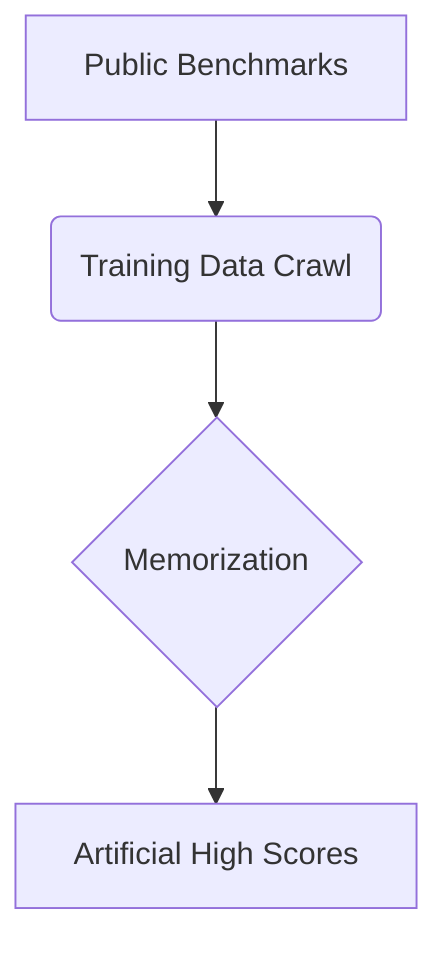

# The Contamination and Dataset Saturation Trap

[< Back to README](../README.md)

Details about data leakage in benchmarks.

```mermaid
graph TD
  A[Public Benchmarks] --> B(Training Data Crawl)
  B --> C{Memorization}
  C --> D[Artificial High Scores]
```
