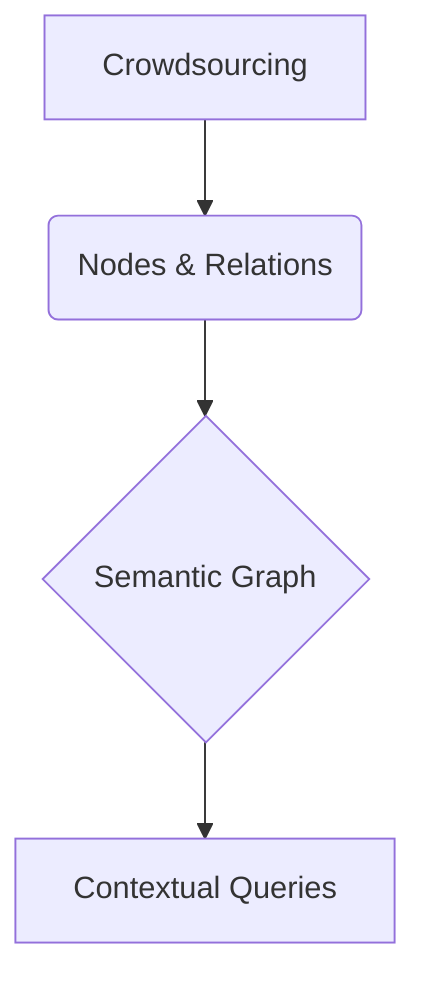

# The Crowdsourced Semantic Knowledge Graph Era

[< Back to README](../README.md)

Details about ConceptNet and ATOMIC.

```mermaid
graph TD
  A[Crowdsourcing] --> B(Nodes & Relations)
  B --> C{Semantic Graph}
  C --> D[Contextual Queries]
```
