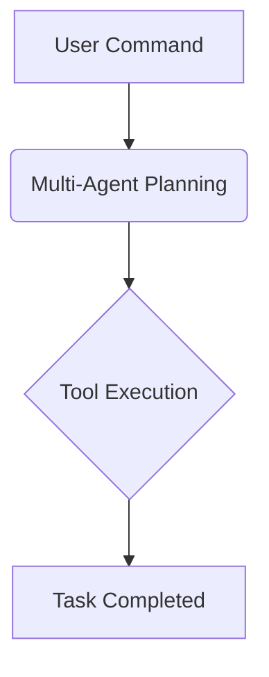

# Enterprise Multi-Agent Corporate Orchestration

[< Back to README](../README.md)

Details about digital agents.

```mermaid
graph TD
  A[User Command] --> B(Multi-Agent Planning)
  B --> C{Tool Execution}
  C --> D[Task Completed]
```
