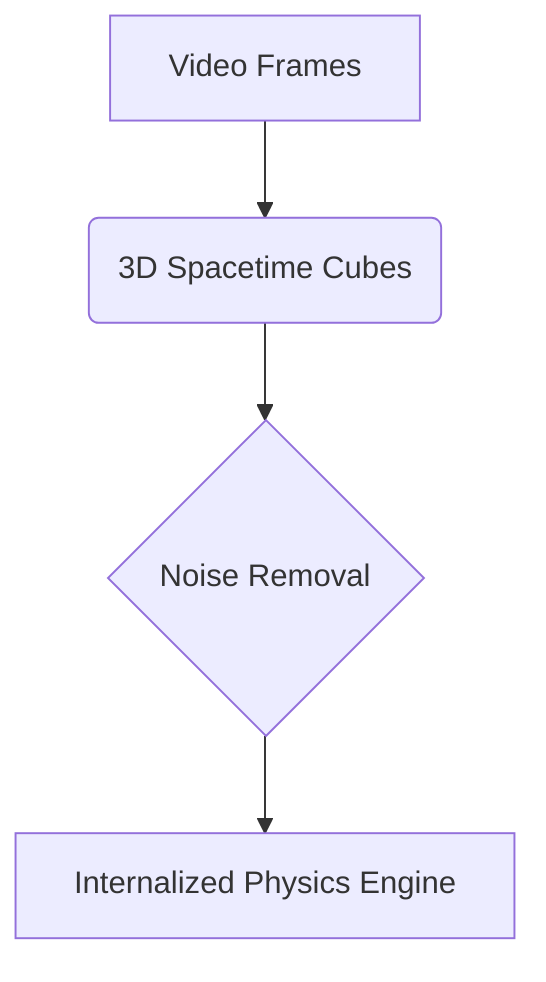

# Generative World Simulators

[< Back to README](../README.md)

Details about Video Diffusion models for physics.

```mermaid
graph TD
  A[Video Frames] --> B(3D Spacetime Cubes)
  B --> C{Noise Removal}
  C --> D[Internalized Physics Engine]
```
