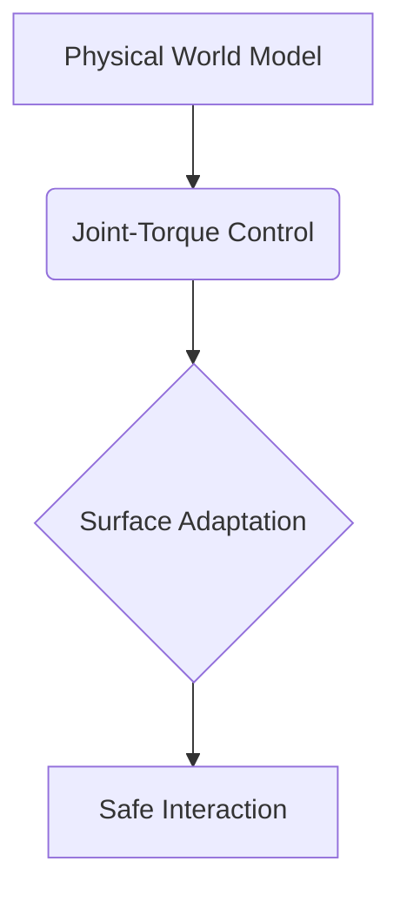

# Multi-Task Autonomous Humanoid Fleets

[< Back to README](../README.md)

Details about robotic logistics.

```mermaid
graph TD
  A[Physical World Model] --> B(Joint-Torque Control)
  B --> C{Surface Adaptation}
  C --> D[Safe Interaction]
```
