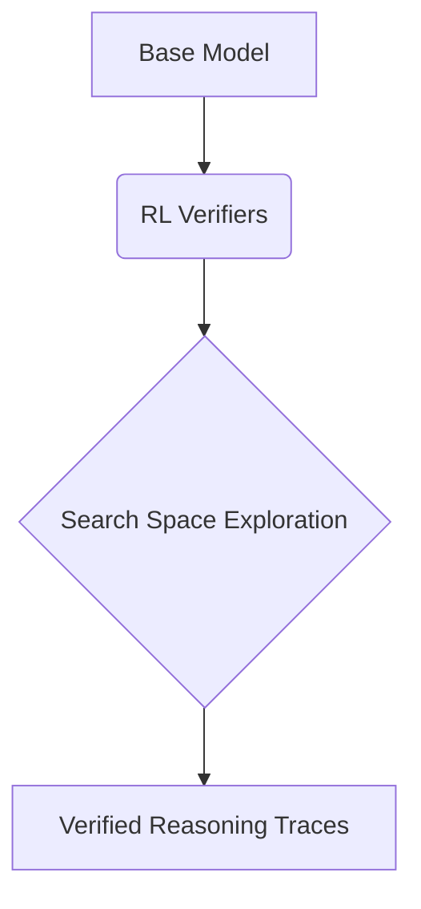

# The Native Reinforcement-Learned Search & Verification Era

[< Back to README](../README.md)

Details about o1, R1 and test-time compute.

```mermaid
graph TD
  A[Base Model] --> B(RL Verifiers)
  B --> C{Search Space Exploration}
  C --> D[Verified Reasoning Traces]
```
