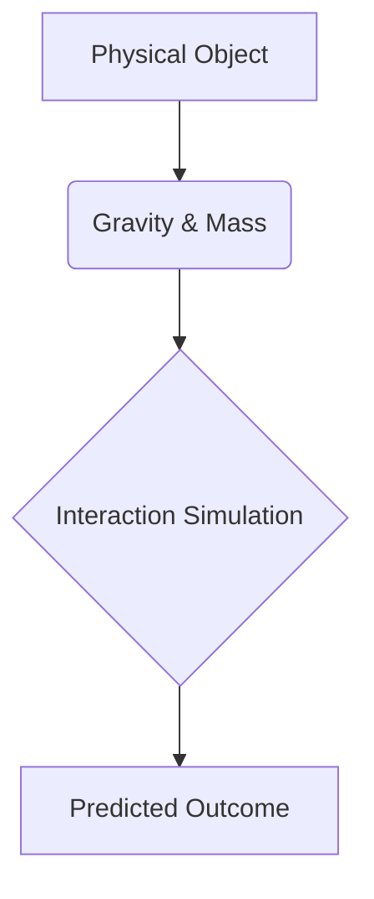

# Physical Commonsense (Spatiotemporal Dynamics)

[< Back to README](../README.md)

Details about intuitive physics.

```mermaid
graph TD
  A[Physical Object] --> B(Gravity & Mass)
  B --> C{Interaction Simulation}
  C --> D[Predicted Outcome]
```
