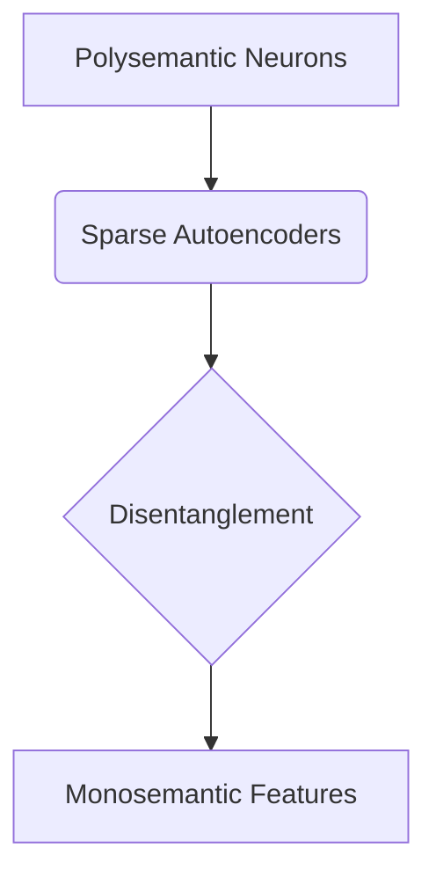

# The Polysemantic Neuron Superposition Challenge

[< Back to README](../README.md)

Details about SAEs and superposition.

```mermaid
graph TD
  A[Polysemantic Neurons] --> B(Sparse Autoencoders)
  B --> C{Disentanglement}
  C --> D[Monosemantic Features]
```
