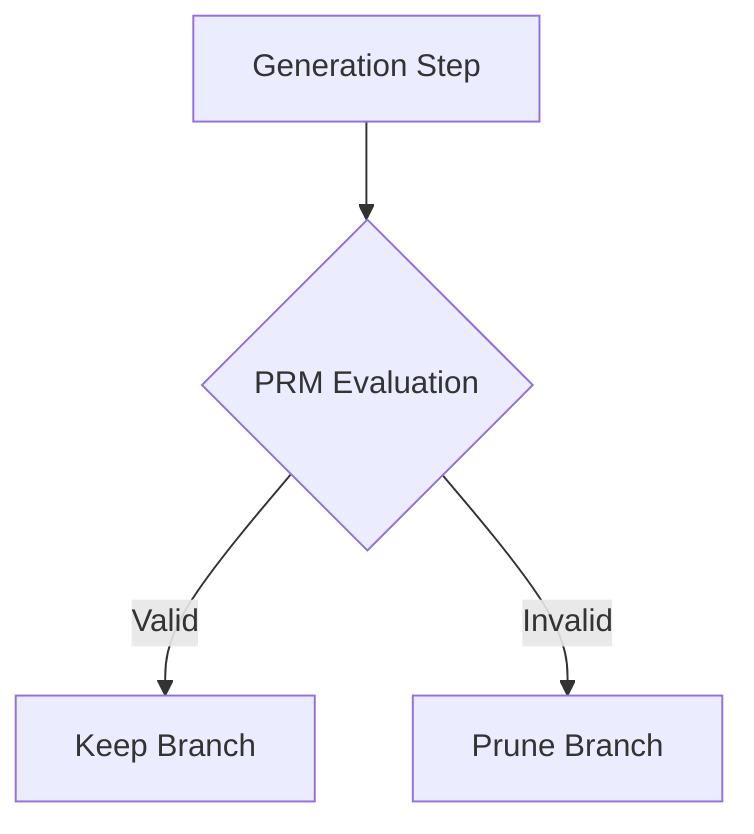

# Process-Supervised Step Verifiers (PRMs)

[< Back to README](../README.md)

Details about token-level monitoring.

```mermaid
graph TD
  A[Generation Step] --> B{PRM Evaluation}
  B -->|Valid| C[Keep Branch]
  B -->|Invalid| D[Prune Branch]
```
