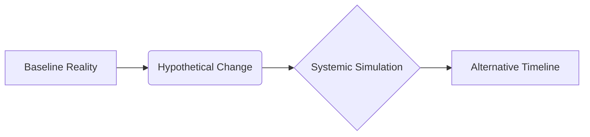

# Qualitative / Counterfactual Reasoning

[< Back to README](../README.md)

Details about hypothetical what-ifs.

```mermaid
graph LR
  A[Baseline Reality] --> B(Hypothetical Change)
  B --> C{Systemic Simulation}
  C --> D[Alternative Timeline]
```
