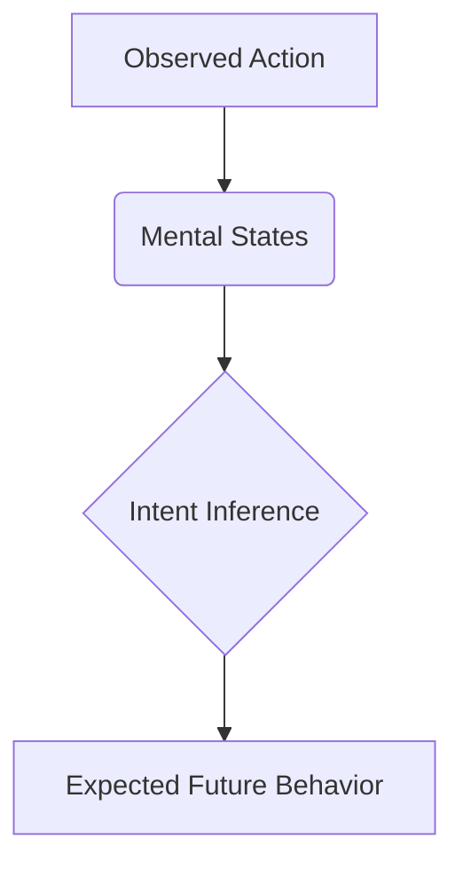

# Social & Psychological Commonsense

[< Back to README](../README.md)

Details about Theory of Mind.

```mermaid
graph TD
  A[Observed Action] --> B(Mental States)
  B --> C{Intent Inference}
  C --> D[Expected Future Behavior]
```
